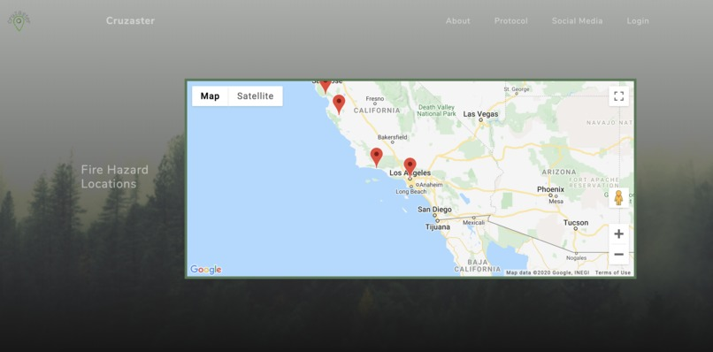
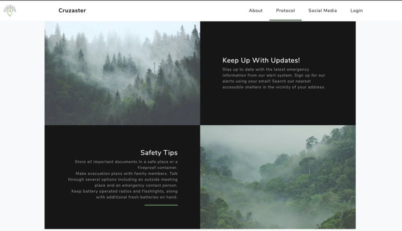

#Inspiration
 
We were inspired to make an app to help people find safe locations to temporarily stay during fire emergencies.

#What it does
 
Cruzaster is a web application that displays active fires pinpointed on a map and users can register their homes or look for places to stay.

#How we built it
 
We built off of an open source template and used HTML (using the Bootstrap framework), CSS, and Javascript for our main interactive design. We used the Google Cloud platform API to build our Google map and display it on the homepage. We used Firebase to store user signup and login data. We also built a Python script to scrape data off of tables in a website to locate the fires.

#Challenges we ran into
 
We were not sure how to store the user data into a database so we first used mySQL and PHP but decided to switch to Firebase after a mentor suggested that it is easier and more efficient to use. Another challenge was using the Google API key for the Google maps because we did not know about the key restrictions and changing settings to enable the key. We were also limited in time so after building the Python script to scrape web data, we did not finish incorporating the extracted data into the web system.

#Accomplishments that we're proud of
 
We built a web scraper in Python, and we are proud of building this tool because we did not know Python beforehand and how to use Python modules.

#What we learned
 
It was very fun to learn how to use the Google Cloud platform and implement it in our website.

#What's next for Cruzaster
 
We plan to expand upon this project by incorporating a database to store user registration for their homes and include the Python web scraper to extract data directly into the website.

#Built With
 
CSS  
HTML  
JavaScript  
Python  
Google API  

